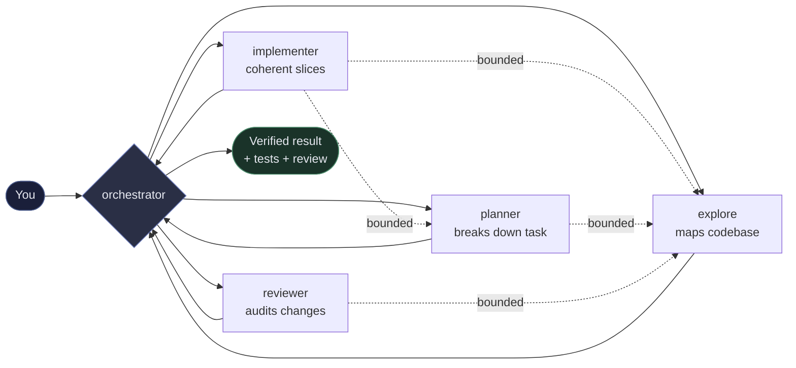

# OpenCode Orchestrator

**Turn one prompt into a coordinated team inside OpenCode.**

Give the orchestrator a task in plain English — it breaks the work down, delegates to specialists, runs work in parallel where safe, and brings back tested, reviewed code. You stay in control while the plugin handles the choreography.

> **Conductor, not worker:** the orchestrator plans and coordinates — specialist subagents do the implementation work in coherent slices.

---

## What it does for you

- **Describe what you want, not how to do it.** `“Add validation to the checkout form and cover it with tests”` Just ask — the orchestrator creates a plan, assigns work, and verifies the result.
- **Coherent slices, not file-sized chores.** The orchestrator prefers the smallest end-to-end slice — coupled code, tests, wiring, and docs under one owner — and splits only at a verified boundary where each resulting slice has its own outcome, acceptance evidence, and no hidden dependency. This is prompt guidance, not a runtime gate; an optional `"decomposition": { "strategy": "strict" }` adds extra emphasis on the same preference and never disables serialization, review, worktree, or publication rules.
- **Truthful capability boundaries.** Prompts distinguish guidance, recorded claims, observed facts, and enforced gates. `max_parallel` and default review are guidance; bounded review records are recorded state until reviewer-child provenance lands; publication revision and remote-state gates are enforced.
- **Parallel where safe, serialized where it matters.** Read-only research runs in parallel. Disjoint write scopes coordinate parallel edits, and any overlap or unknown coupling is serialized — never written concurrently.
- **Built-in review.** Every implementation is audited by a dedicated reviewer before you see the final result.
- **Asks before it guesses.** When a request is ambiguous, the orchestrator asks you a few targeted questions — with answer options — before breaking the work down. It explores repository facts first and workers never ask on your behalf; this is prompt guidance, not a hard runtime gate. Disable with `"clarify": { "mode": "off" }`.
- **Goals that survive idle.** Start a long-running objective and let it continue during idle periods in the same OpenCode session.
- **A durable lead board behind goals and plan runs.** `/goal` and `/run-plan` continuations advance a persisted task DAG — dependency-ordered reservations, conservative receipt recovery across restarts, and lead-only completion after rerunning the checks and matching an approved exact-revision review. Scope packets are advisory, not isolation, and the board is durable but not transactional or exactly-once.
- **A read-only Orchestrator sessions sidebar.** When the host exposes session tabs, the TUI sidebar lists the sessions running your configured orchestrator with each session’s live status (`busy` / `running` / `idle`, or `unknown` when no state is known) and cost. It reads reactive client caches only — no storage, git, or GitHub writes — and hosts without session tabs skip it entirely.
- **Optional power features** when you need them: GitHub and git worktree integration, budgets and review gates, a durable `/publish` publication capability with per-session `/gates` narrowing, and same-project peer-orchestrator discovery.

### The team

| Agent | What it does |
|-------|--------------|
| **orchestrator** | Your main partner. Understands your request, plans the work, delegates, and verifies everything. |
| **planner** | Breaks down complex tasks without editing code. |
| **explore** | Maps your codebase, tests, and docs — fast, read-only research with direct `webfetch`/`websearch`. |
| **implementer** | Makes coherent end-to-end changes within an assigned slice scope. |
| **reviewer** | Audits the combined changes before they’re presented to you. |

You only talk to the orchestrator. It handles the rest.

### Bounded nested delegation

Specialists can delegate too, but only along a fixed graph — every delegating worker stays accountable for its children, and each child gets the same self-contained task contract:

```
orchestrator → planner, explore, implementer, reviewer
implementer  → planner, explore
planner      → explore
reviewer     → explore
explore      → (nothing — answers directly, using webfetch/websearch itself)
```

Delegation outside an agent’s own graph is off-limits even if the host would allow it, and the orchestrator verifies child claims directly instead of trusting a child’s self-report.

> **Native depth:** OpenCode’s native **top-level** `subagent_depth` defaults to 1 — *"Maximum subagent nesting depth. Defaults to 1, which prevents subagents from launching subagents"* — so without it, a worker could never delegate further. The deepest approved chain above is three subagent hops, and the installer therefore sets `subagent_depth: 3` in your config, but only when the key is absent: an explicit value you set (lower or higher) always wins. The key is top-level — the older `experimental.subagent_depth` spelling is dead on the current host schema (`experimental` rejects additional properties) — and the installer migrates a legacy nested value up for you. The plugin itself does not enforce depth — it’s a native OpenCode setting.

---

## When should I use it?

| You want to… | Use this | Example |
|--------------|----------|---------|
| Build a feature or fix a bug in one go | `/orchestrate` | *“Fix the race in session locking and add a regression test”* |
| Keep a long objective running through idle periods | `/goal` | *“Ship the checkout refactor without regressing payments”* |
| Refactor safely | `/restructure` | `src/core/config.ts --scope=file` |
| Run a written plan | `/run-plan` | `.orchestrator/plans/my-feature.md` |
| Clean up code you just touched | `/polish` | `src/core/policy.ts` |
| Critique a plan before coding | `/stress-plan` | *“Add rate limiting with Redis fallback”* |
| Pause automation | `/halt` | — |
| Hand context to the next session | `/handover` | *“Focus on payments regression”* |
| Choose models for worker agents | `/worker-models` | — |
| Inspect or toggle the durable publication capability | `/publish` | `/publish status` |
| Narrow the publication/gate steps for this session only | `/gates` | `/gates merge=off` |

For a single-file typo or one-line edit, just prompt the model directly — you don’t need orchestration.

---

## Installation

**Prerequisites:** [Bun](https://bun.sh), [npm](https://docs.npmjs.com/downloading-and-installing-node-js-and-npm), [OpenCode V2](https://opencode.ai), `git` (and `gh` CLI if you want GitHub features).

Install the [published release from npm](https://www.npmjs.com/package/opencode-v2-agent-orchestrator) in your project:

```sh
cd your-project
npm install --save-dev opencode-v2-agent-orchestrator

# Add the plugin + agents to your opencode.jsonc
# (add --global to target OpenCode's global config instead)
./node_modules/.bin/opencode-v2-agent-orchestrator install \
  --model orchestrator=openai/gpt-5#high \
  --model explore=opencode-go/mimo-v2.5

# Verify
./node_modules/.bin/opencode-v2-agent-orchestrator doctor
```

What the installer does:
- Adds the plugin to `opencode.jsonc` (as a local file reference like `./node_modules/.../dist/index.js`)
- Accepts `--global` to write to OpenCode’s global config instead of a project’s `opencode.jsonc` — `$XDG_CONFIG_HOME/opencode/opencode.jsonc`, or `~/.config/opencode/opencode.jsonc` when `XDG_CONFIG_HOME` is unset
- Adds the five agents (`orchestrator`, `planner`, `explore`, `implementer`, `reviewer`) if they’re missing
- Sets top-level `subagent_depth: 3` (only when the key is absent) so OpenCode’s native subagent depth limit — which defaults to 1 — doesn’t block the deepest approved chain `orchestrator → implementer → planner → explore`; a legacy nested `experimental.subagent_depth` value is migrated to the top level (value preserved, stale nested key removed)
- Adds the recommended host keys `experimental.continue_loop_on_deny: true` (a denied tool call keeps the agent loop alive instead of terminating it) and `experimental.batch_tool: true` (per-turn parallel tool invocation) — each only when the key is absent and never overwriting an explicit value (see [Recommended host keys](#recommended-host-keys))
- Gives new agents permission defaults that allow exactly the bounded nested-delegation graph (see [Bounded nested delegation](#bounded-nested-delegation)): a broad `subagent` deny followed by exact target-specific allows, with `webfetch`/`websearch` granted directly to `explore`
- Writes the orchestrator-only permission actions for the feature tool families — `orchestrator_gh`, `orchestrator_worktree`, `orchestrator_validation` (the serialized validation tools plus the durable lead-board tools), `orchestrator_observability`, plus the publication policy (`orchestrator_publish`), peer discovery (`orchestrator_peer`), and the read-only session gate inspection (`orchestrator_gates`) — as `allow` for the orchestrator and `deny` for every worker
- Leaves your existing config and commands untouched — re-running it is safe

> **Upgrading?** The installer never rewrites agents that already exist in your config. If your workers were installed by an older version (before nested delegation), they carry a flat `subagent` deny and cannot delegate. Either delete the old agent entries and reinstall, or add the target-specific allows yourself — for example, to `implementer`:
>
> ```jsonc
> "permissions": [
>   { "action": "subagent", "resource": "*", "effect": "deny" },
>   { "action": "subagent", "resource": "planner", "effect": "allow" },
>   { "action": "subagent", "resource": "explore", "effect": "allow" }
> ]
> ```
>
> Agents preserved from an older install also predate the shared permission actions for the newer tool families (`orchestrator_publish`, `orchestrator_peer`, `orchestrator_gates`): the plugin’s agent transform appends the family rules automatically only when no exact rule exists, and an explicit user-authored rule is never overridden. To migrate by hand, add to the **orchestrator**:
>
> ```jsonc
> { "action": "orchestrator_publish", "resource": "*", "effect": "allow" },
> { "action": "orchestrator_peer", "resource": "*", "effect": "allow" },
> { "action": "orchestrator_gates", "resource": "*", "effect": "allow" }
> ```
>
> and the same three actions with `"effect": "deny"` to each worker you want kept locked down. Anything you write explicitly stays authoritative — the installer and the agent transform never rewrite it.
>
> The plugin’s agent transform never overrides user-authored permission rules, so whatever you write stays authoritative. Re-running the installer also adds top-level `subagent_depth: 3` when that key is absent — migrating a legacy nested `experimental.subagent_depth` value up (value preserved, stale key removed) — plus the recommended `experimental.continue_loop_on_deny: true` and `experimental.batch_tool: true` when they are absent; an explicit value you set is always preserved.

> Working from a source checkout? Configure OpenCode to load `./src/index.ts` and see [Development](#development). This repository's live setup uses global config; the checkout has no repo-level `opencode.jsonc`.

Check that it worked:

```sh
./node_modules/.bin/opencode-v2-agent-orchestrator doctor --json
# plus, once OpenCode is running:
opencode2 api get /api/plugin | jq -r '.data // . | .[].id' | grep opencode-orchestrator
```

---

## Quick start

```sh
cd your-project
opencode2
```

Then in the TUI:

```
/orchestrate add input validation to the user form and cover it with tests
```

The orchestrator will research the codebase, plan the changes, delegate coherent end-to-end slices with disjoint write scopes to `implementer` agents, run a `reviewer`, and report back with verification.

---

## See it in action


| What you'd see | You type |
|----------------|----------|
| Research → plan → parallel edits → review, all summarized in one reply | `/orchestrate add pagination to /api/items with tests` |
| Goal keeps running while you step away | `/goal implement the plan at .orchestrator/plans/checkout.md` |

> **Make it yours:** record a 20–40s GIF with [VHS](https://github.com/charmbracelet/vhs), Screen Studio, or Peek, save it as `docs/assets/orchestrate-demo.gif` (and `goal-demo.gif`), then swap the image above. See `docs/assets/README.md` for a ready-to-use VHS tape.



*You talk only to the orchestrator — it coordinates the specialists and brings back a verified result. Dashed arrows are the bounded nested-delegation edges: workers may delegate only downward, and `explore` answers directly without delegating.*

---

## How to use — commands & examples

All commands are available after installation. They appear inside OpenCode — no files to create manually.

Three workflows, pick one: **one-shot** (`/orchestrate` — research, plan in-reply, implement, review, report), **durable plan** (`/stress-plan` writes `.orchestrator/plans/*.md`, `/run-plan` executes it phase by phase), **persistent objective** (`/goal` keeps working across idle continuations, and can drive a plan via `/goal implement the plan at .orchestrator/plans/checkout.md`).

### `/orchestrate <task>` — your main command

One prompt that fans out, integrates, and verifies.

```
/orchestrate fix the race in session locking and add a regression test
/orchestrate implement the new webhook endpoint with tests and docs
/orchestrate add cursor-based pagination to /api/items with tests and update the docs
```

**Tip:** Be specific about the outcome you want and any constraints (“without changing the API”, “cover with tests”).

### `/goal` — for work that outlives one turn

Set an objective keyed to the current OpenCode session. The orchestrator can keep working toward it when that same session emits idle events.

```
/goal ship the checkout refactor without regressing payments
/goal implement the plan at .orchestrator/plans/checkout.md
/goal            # show current goal
/goal pause      # pause without deleting
/goal resume     # continue
/goal clear      # remove it
```

Goals auto-continue when that session goes idle (up to 50 continuations by default, with a cooldown). The orchestrator checks before each continuation that the goal is still active and unchanged. When a plan run is active, the continuation prompt embeds the plan ledger path and requires the orchestrator to execute the first unfinished ledger item with direct verification, update the ledger, and keep advancing in order — unless a real blocker or a configured breaker applies (halt flag, budget fail-closed, cooldown, max continuations, or an open review circuit), and it never marks the goal or plan complete without direct evidence. Deleting the session removes its goal state. Goals and plan runs are tracked by a durable [lead board](#the-durable-lead-board-goal-and-run-plan) that survives restarts.

### `/restructure` — safe refactoring

Behavior must not change. The plugin maps references and tests first.

```
/restructure src/core/config.ts --scope=file
/restructure src/opencode-v2 --scope=module --risk=broad
```

Valid scopes are `--scope=file|module|project`; with project scope, target `.` or `project`.

It writes the phased plan under `.orchestrator/plans/` before executing it, so the steps stay reviewable.

### `/stress-plan` — write a reviewed plan file

Drafts a plan for the given topic, critiques it from four angles (correctness, simplicity, security, feasibility), then finalizes it under `.orchestrator/plans/` for `/run-plan` to execute.

```
/stress-plan add rate limiting to the API with redis fallback
```

### `/run-plan` — execute a written plan

Put plans in `.orchestrator/plans/*.md` (via `/stress-plan` or `/restructure`, or by hand).

```
/run-plan                    # picks the only incomplete plan, or resumes
/run-plan my-feature         # .orchestrator/plans/my-feature.md
```

Mark a plan done with `status: complete` in frontmatter or a `## Status / complete` heading.

Starting a plan run enrolls the current goal generation on its [durable lead board](#the-durable-lead-board-goal-and-run-plan); continuations then advance that board's dependency-ready tasks.

### The durable lead board (`/goal` and `/run-plan`)

Every goal generation gets a durable **lead board** — a bounded task ledger keyed to the session's stable origin project, so it survives idle periods, restarts, and session moves and is removed with the session. `/goal` enrolls the new generation and `/run-plan` enrolls the current one (either can be re-enrolled explicitly with `orchestrator_lead_board_init`), so plan continuations advance ledger tasks instead of re-deriving work.

- **Task DAG.** A board starts as one planned root task, and children are added through a strict validator (unique ids, known dependencies, no self-dependencies or cycles). A task becomes `ready` only when its dependencies are `completed`, reserves one continuation step at a time, and persists the step identity before a prompt is queued; restart recovery never replays a prior step.
- **Conservative restart recovery.** A missing board is `board-missing` (the legacy goal-only path still works); a malformed or identity-mismatched board is `board-unavailable` — never auto-repaired and never dispatched from. A missing, malformed, unreadable, pending, dispatched, or failed receipt marks the claimed task `ambiguous` (the possible external effect is retained as a claim), and a completed idle-edge receipt advances a task at most to `awaiting-validation`, never to `completed`. Recovery is a fresh read plus an explicit lead transition.
- **Advisory scope packets, conservative serialization.** Each task carries a bounded read/write packet (relative paths under a `project` or `managed-worktree` root). Write/write and write/read overlaps serialize, any broad, unknown, malformed, or unresolvable scope conflicts with active writes, and read/read work may proceed; a conflict leaves the task `ready`, not failed. Serialization is single-process only, and packets are coordination guidance — **not** filesystem isolation, a permission boundary, or a worktree binding.
- **Lead-only completion.** A worker handoff is a report, never completion: the lead validates the unchanged D2 envelope, reruns every required command itself, and records bounded results plus the exact head revision. Completion also requires an approved exact-revision review for that same revision. The board completes only when every task is `completed`, aggregate verification passes in the lead context, the review matches, and the goal generation is unchanged; `orchestrator_goal_update` refuses goal completion while an enrolled board is not `complete` (a malformed board fails closed; a missing board keeps the legacy path).
- **Lost PR responses are reconciled.** For draft-PR creation and merge, a bounded replay descriptor is persisted before the mutation; a retry or restart reads fresh remote truth first — an exact-match open PR is adopted with no second POST, a `merged: true` PR is adopted with no second PUT, and a missing or mismatched read stays ambiguous/blocked instead of retrying blindly.

The board is durable but **not transactional or cross-process isolated**: it runs under the same process-local session lock, with no exactly-once, event-log, or scheduler/lease guarantee, and a replay descriptor makes a replay detectable — never an external side effect idempotent. Inspect it read-only with `orchestrator_lead_board_get` (a bounded projection, never raw receipts or transcripts); the six board tools share the existing orchestrator-only `orchestrator_validation` permission family, so no new permission action is needed.

### Other commands

```
/halt              # pause goal + plan runs
/halt goal
/handover          # get a summary brief for the next person/session
/handover focus on payments regression
/polish            # clean up only files changed in this branch
/polish src/core/policy.ts src/core/prompts.ts
/publish status    # inspect the durable project-scoped publication policy
/publish enable    # opt in per project (requires publish.enabled: true in config)
/publish disable   # revoke the durable authorization
/gates             # open the TUI gate picker for this session
/gates <gate>=off  # narrow one step for this session only
/gates <gate>=on   # re-enable it (never beyond the project/config ceiling)
/gates reset       # clear this session's narrowing
/worker-models            # open the TUI worker-model picker
/worker-models explore=default
/worker-models reset      # restore all workers to configured models
```

See [`/stress-plan`](#stress-plan--write-a-reviewed-plan-file) for writing plans and [`/run-plan`](#run-plan--execute-a-written-plan) for executing them.
`/publish` toggles a durable, project-scoped **authorization policy** — see [Publication capability](#publication-capability-publish) for exactly what it does and does not authorize.
`/gates` shows and narrows the per-session orchestrator gates (`push`, `pr-draft-create`, `pr-ready-transition`, `approve-after-review`, `merge`, `github-mutations`, `worktree-mutations`). Running it with no argument opens the TUI gate picker; `/gates <gate>=off` narrows one step for this session, `/gates <gate>=on` removes that narrowing, and `/gates reset` follows the project ceiling again. A session can only **narrow** the project/config ceiling and can never widen it — turning a gate on still requires the ceiling (the durable publication capability or the static `github`/`worktree` mutation switches) to allow it. Session gates apply to the current session only.
`/worker-models` selects durable runtime models for `planner`, `explore`, `implementer`, and `reviewer` only. The TUI picker lists enabled, tool-capable models and their variants. Text form accepts `worker=provider/model[#variant]`, `worker=default`, `list`, and `reset`.

---

## Configuration

You configure baseline **models** with OpenCode’s native `agents.<id>.model`; the TUI can apply durable worker-only overrides at runtime:

```jsonc
// opencode.jsonc
{
  "plugins": [{
    "package": "./node_modules/opencode-v2-agent-orchestrator/dist/index.js",
    "options": {
      "orchestrator": "orchestrator",
      "roles": {
        "planning": "planner",
        "research": "explore",
        "implementation": "implementer",
        "review": "reviewer"
      },
      "max_parallel": 4,        // instructed dispatch ceiling, not yet a runtime cap (1..8)
      "require_review": true,   // ask a reviewer before finishing (prompt policy; exact-revision review receipts require bounded mode)
      "strict_agents": true,    // throw when a required agent is confirmed missing or has the wrong mode; false warns and continues
      "commands": {},           // disable a command, e.g. { "polish": false }
      "goal": { "auto_continue": true, "max_continuations": 50, "cooldown_ms": 1000 },
      "github": { "enabled": false, "allow_mutations": false },
      "worktree": { "enabled": false, "allow_mutations": false, "root": null },
      "publish": { "enabled": false }, // master gate for the durable publication capability (default off)
      "trace": { "mode": "off" },                  // off | memory | snapshot
      "budget": { "mode": "advisory" },            // advisory | stop-between-steps
      "review": { "mode": "prompt", "max_rounds": 2 }, // prompt | bounded
      "clarify": { "mode": "auto" },               // auto | off — explore repo facts first, then ask targeted questions when a task is ambiguous
      "decomposition": { "strategy": "mvp" }       // mvp | strict — strict adds prompt-level emphasis on coherent end-to-end slices; never a runtime gate
    }
  }],
  // If worktree.root lives outside your project, allow it:
  // "permissions": [{ "action": "external_directory", "resource": "/srv/worktrees/*", "effect": "allow" }],

  "agents": {
    "orchestrator": { "mode": "primary",  "model": "openai/gpt-5#high" },
    "planner":      { "mode": "subagent", "model": "openai/gpt-5-mini" },
    "explore":      { "mode": "subagent", "model": "opencode-go/mimo-v2.5" },
    "implementer":  { "mode": "subagent", "model": "opencode-go/deepseek-v4-flash#high" },
    "reviewer":     { "mode": "subagent", "model": "opencode-go/grok-4.6#high" }
  }
}
```

`require_review`, `clarify`, and `max_parallel` are prompt guidance, not hard runtime gates: they shape what the orchestrator is instructed to do, and the orchestrator explores repository facts before asking anything — workers never ask on your behalf. Bounded review records are strict recorded state, but the current V1 record does not prove reviewer-child identity. Publication exact-revision and remote-state checks are enforced. `decomposition.strategy` is prompt policy too: `"strict"` only adds emphasis on the coherent end-to-end slice preference (default `"mvp"` preserves the current behavior) and never disables serialization, scope validation, review, worktree lifecycle, or publication preconditions. `strict_agents` is different: `true` throws at startup for a confirmed missing or wrong-mode required agent, while `false` downgrades that to a warning and continues. OpenCode’s beta startup can materialize config-backed agents after external plugins load, so an early missing-agent or empty-list result is treated as pending — validation is deferred and re-checked when the agents arrive instead of failing setup.

### Recommended host keys

The installer writes these native OpenCode keys — each only when absent, and never overwriting an explicit value you set:

| Key | Value | Why |
|-----|-------|-----|
| `subagent_depth` (top-level) | `3` | Native subagent nesting limit; `1` would stop `orchestrator → implementer → planner → explore` after the first hop. The older `experimental.subagent_depth` spelling is dead on the current host schema, so the installer migrates a legacy nested value up |
| `experimental.continue_loop_on_deny` | `true` | Continue the agent loop when a tool call is denied, so orchestrator-only denials and runtime-authority refusals stay recoverable instead of terminating the model’s loop |
| `experimental.batch_tool` | `true` | Enable per-turn parallel tool invocation |

```jsonc
{
  "subagent_depth": 3,
  "experimental": { "continue_loop_on_deny": true, "batch_tool": true }
}
```

### Choosing models

| Agent | Recommended tier | Why |
|-------|----------------|-----|
| `orchestrator` | 5 (frontier) | Never downgrade this one first — it does all coordination |
| `reviewer` | 4–5 | Needs strong judgment |
| `implementer` / `planner` | 4 | Capable but cheaper than frontier |
| `explore` | 2 (cheap/fast) | Runs in parallel — cheap wins |

Model IDs shown here are illustrative; availability varies by provider and account.

The installer also writes each agent’s `permissions` for you: a broad `subagent` deny plus exact target-specific allows matching the [bounded nested-delegation graph](#bounded-nested-delegation), and direct `webfetch`/`websearch` for `explore`. Agents you add or preserve yourself keep whatever permissions you write — the plugin never overrides them.

Change a baseline model later by editing `agents.<id>.model` directly — no reinstall needed. For temporary or run-specific worker choices, use `/worker-models` in the TUI instead; overrides survive service restarts, follow the repository across this plugin’s managed worktrees, and apply to children spawned after the change. Existing child sessions keep their current model. `/worker-models worker=default` clears one override and `/worker-models reset` clears them all. The orchestrator model remains config-controlled.

---

## Real-world examples

**Add a feature with tests**

```
/orchestrate add cursor-based pagination to GET /api/items,
  keep the existing offset param working, and update the API docs
```

→ The orchestrator will explore existing pagination, plan the API change, delegate implementation with tests, run a reviewer, and summarize.

**Fix a bug with a regression test**

```
/orchestrate fix the checkout race when two tabs submit at once,
  add a regression test that reproduces it first
```

**Long-running objective**

```
/goal implement the plan at .orchestrator/plans/checkout.md
# leave this OpenCode session idle, then come back
/goal   # check progress
```

**Safe restructure**

```
/restructure src/services/payments --scope=module --risk=conservative
```

---

## Optional power features

All disabled by default. Enable only what you need.

### GitHub integration

Let the orchestrator create and list issues/PRs via your local `gh` CLI.

```jsonc
"github": { "enabled": true, "allow_mutations": false }
```

- Read-only (list/view) needs only `enabled: true`
- Creating issues/PRs needs `allow_mutations: true` **and** `confirm: true` on each call
- Pull requests are **always created as drafts** — `orchestrator_github_pr_create` has no draft toggle; the client sends `draft: true` and refuses a response that is not a draft. A PR is moved to ready (`orchestrator_github_pr_ready`) only when a fresh view directly proves the exact head revision, `draft: true`, `mergeable: true`, no dirty/unknown conflict state, and current remote base ancestry; unknown mergeability stays draft and is truthfully deferred — no polling
- Automatic approval (`orchestrator_github_pr_approve`) is **optional and best-effort**: it requires the ready transition, an exact-revision approved internal review, a non-author authenticated viewer, and fresh conflict-free evidence. A same-author attempt (the usual single-collaborator case), a missing `approve-after-review` capability, or an API failure is refused and reported truthfully with no success evidence — and that refusal **never blocks the merge**, because a GitHub APPROVE review is not a merge precondition. The automated approval is never claimed to satisfy branch protection
- Merging (`orchestrator_github_pr_merge`) is **autonomous** once the durable `merge` capability and the per-session `merge` gate allow it: no separate user request, no GitHub APPROVE review, and no `confirm` flag are involved. It merges only after a fresh view proves the exact head/base revision, an open, unmerged, non-draft, `mergeable: true` pull with no dirty/unknown conflict state, the current remote base as an ancestor of the exact head, and an exact-revision approved internal review receipt — then verifies `merged: true` with a fresh post-merge view. A refused or skipped best-effort approval is not a precondition; any moved SHA, conflict, missing receipt, branch protection, required check/review, permission failure, or merge queue is reported truthfully, never bypassed or polled
- **Lost PR responses are reconciled, never retried blindly.** Draft-PR creation and merge persist a bounded replay descriptor before the mutation and, on any retry or restart, read fresh remote truth first: an exact-match open PR is adopted with no second POST, an already-merged PR is adopted with no second PUT, and a missing or ambiguous match stays `ambiguous`/`blocked`. The bounded open-PR list is a page-bounded compensating control — absence of a match is not proof of absence — so a descriptor makes a replay detectable, never idempotent; every config, capability, gate, confirmation, ancestry, conflict, and exact-revision review precondition still applies to any retry.
- Auth stays with `gh` — run `gh auth login` with least privilege. The plugin never reads tokens.
- Verify: `orchestrator_github_capabilities` (inside OpenCode) or `gh auth status` locally

### Git worktrees (separate checkouts)

Give the current session a separate checkout and branch without changing your main checkout.

```jsonc
"worktree": { "enabled": true, "allow_mutations": true, "root": "/srv/worktrees" }
```

- One managed worktree per current session, under the `root` you choose
- The orchestrator creates → enters → then delegates. Entering moves only the current session; delegated children inherit and share that context, not an atomic sandbox. OpenCode may complete a current-session move at the next safe boundary, so a pending enter is not a receipt—retry until `entered:true` before delegating.
- Create, sync, push, and cleanup require `worktree.allow_mutations: true` and a literal `confirm: true` on each call. Enter requires neither beyond `worktree.enabled: true`.
- `orchestrator_worktree_sync` fetches the latest remote base branch and merges it into the tracked branch when needed, recording an exact-revision sync receipt. It refuses a dirty tree and never resolves conflicts automatically: a conflicted merge is aborted and reported truthfully (safe relative unmerged paths only). After a conflict, the orchestrator autonomously delegates an implementer to perform the merge/resolution in the tracked worktree, then reruns verification and sync, commits, and restarts the exact-revision review — stopping only if the conflicts cannot safely be resolved.
- Verify: `./node_modules/.bin/opencode-v2-agent-orchestrator doctor` checks `git worktree list`

### Publication capability (`/publish`)

A durable, project-scoped authorization for the publication steps. Off by default at every level.

```jsonc
"publish": { "enabled": true },   // master gate; default { "enabled": false }
"review": { "mode": "bounded" }   // exact-revision review receipts require bounded mode
```

Three prerequisites must all be in place before the orchestrator may publish autonomously:

1. **Config master gate** — `publish.enabled: true` in the plugin options (default `false`). With the gate off, `/publish enable` is refused and `/publish status` / `/publish disable` still work so a stale authorization can always be inspected and revoked.
2. **Durable per-project capability** — `/publish enable` writes a durable record keyed to the stable project (it follows the repository across session moves; `/publish disable` revokes it). Idempotent toggling writes nothing when the record is unchanged.
3. **Bounded review mode** — `review.mode: "bounded"` (default `"prompt"`). Every publication step requires an exact-revision approved review receipt, which comes from the bounded review record; the `review_get` / `review_transition` tools are only registered in `bounded` mode, so with the default `"prompt"` no review record can ever exist and publication **fails closed** ("no review record exists") until `review.mode: "bounded"` is enabled.

What the capability means:

- **Authorization policy, not authentication.** The durable record says the project capability is enabled and lists what it authorizes; nothing in it proves which human invoked `/publish`. It never mutates Git or GitHub itself, and it never weakens the static `github.enabled` / `github.allow_mutations` / `worktree.enabled` / `worktree.allow_mutations` gates.
- **When enabled, it authorizes the orchestrator to pass `confirm: true` without re-prompting** for exactly five steps: worktree push, draft PR creation, the draft-to-ready transition, the verified post-ready approval (best-effort and optional — a truthful refusal never blocks the merge), and the merge once the full merge precondition chain passes. It **never authorizes issue creation** (still gated on `github.allow_mutations` + `confirm: true`). Merge is the fifth authorized capability — not a separate approval.
- Every publication step still runs the full fail-closed gate chain: static gates, the durable capability, the per-session gates, a clean tree, an unchanged latest remote base, the exact synced head, base ancestry, and an exact-revision approved internal review receipt. The confirm-gated steps additionally require a literal `confirm: true`; the autonomous merge does not.

Mandatory sequence (prompt policy, enforced by the tools):

```
commit clean changes → worktree_sync against the latest remote base →
verify/test → exact-revision bounded review → worktree_push → draft PR create →
ready → best-effort approve at the exact revision (optional; a refusal never blocks) →
merge at the exact approved SHA →
post-merge verify → worktree cleanup
```

If the sync reports conflicts after aborting, the orchestrator delegates an implementer to resolve them in the tracked worktree, reruns verification/sync, commits, and restarts the exact-revision review; it stops only when conflicts cannot safely be resolved. If the base or head changes after the review, it re-syncs and re-reviews. A push without a sync receipt, with a moved base, a changed head, or a missing/mismatched approved review receipt is refused.

**Merge is the fifth authorized capability, and it is autonomous.** `orchestrator_github_pr_merge` needs no separate user request, no GitHub APPROVE review, and ignores a `confirm` flag. A refused or skipped best-effort approval — including self-approval in a single-collaborator repo — is **not** a merge precondition: the review authority is the exact-revision approved internal review receipt. It requires the durable `merge` capability plus the per-session `merge` gate, that exact-revision approved internal review receipt for the same head/base, and a fresh `orchestrator_github_pr_view` proving the pull is open, unmerged, and non-draft with `mergeable: true` and no dirty or unknown conflict state. It checks the exact expected head and base SHAs, requires the current remote base to be an ancestor of the exact head, merges with that exact SHA, then proves `merged: true` with a fresh post-merge view. Branch protection, required checks or reviews, permission failures, and merge queues are reported truthfully — never bypassed, never polled.

**Definition of Done (terminal drive):** a ship-shaped task is finished only when it is merged and the tracked worktree is cleaned up, or when a configured gate or missing capability refuses the next terminal step. The orchestrator runs the terminal chain as soon as the work is verified — it never stops at “changes are ready” or “the PR is open” and waits for you to ask for the merge. If a session-disabled `/gates` step or a missing durable capability refuses a step, it names the exact step and the one command that would change it instead of re-planning around the gate.

A session can narrow (never widen) any of these steps for the current session with `/gates`; see the command description above. A gate disabled for the session is final until you re-enable it.

Verify the current policy inside OpenCode with `/publish status` or `orchestrator_publish_policy_get` (read-only, orchestrator-only). Tool: `orchestrator_publish_policy_get`.

### Peer-orchestrator discovery

`orchestrator_peer_list` (orchestrator-only) lists bounded metadata about other orchestrator sessions **in the same stable project**: session ID, goal status, and a redacted/truncated objective hint, ordered deterministically with an opaque `after` cursor. It is durable metadata only and never live-complete:

- never full objectives, transcripts, prompts, files, or credentials — known-pattern redaction runs before truncation
- only goal records keyed under the caller’s own project are ever read
- sessions without a readable goal record do not appear; `complete: false` is reported truthfully when `storage.scan` is unavailable or the bounded scan cap is hit

This tells you concurrent orchestration exists and what its goal state is — it is not a live directory of sessions.

For a closer look, `orchestrator_session_status` (orchestrator-only, read-only) returns per-session summaries under the same stable project: pass a `sessionID` for that session’s goal/worktree/review summary (`summary: null` when no readable goal record exists), or omit it for a bounded, cursor-paginated session list with the same ordering, scan cap, and cursor semantics as `orchestrator_peer_list`. Objective hints, branch names, and worktree paths are known-pattern-redacted and length-truncated; SHAs, task IDs, repos, bases, evidence, transcripts, and credentials never leave the query, and nothing is mutated. Like peer discovery, it returns durable metadata that is never live-complete — `complete: false` means `storage.scan` is unavailable or the bounded scan cap was hit.

### Budgets, tracing & review gates (observability)

For teams that want cost/usage limits or a stricter review gate:

```jsonc
"trace": { "mode": "snapshot" },
"budget": {
  "mode": "stop-between-steps",
  "max_steps": 1000,
  "max_tokens": null,
  "max_cost_usd": 10,
  "max_wall_clock_ms": null,
  "max_retries": 5
},
"review": { "mode": "bounded", "max_rounds": 2 } // requires explicit approve before finishing
```

- **Trace** `memory` keeps bounded metadata in memory and never persists it; `snapshot` additionally stores one bounded current metadata record per session. Neither stores prompts, transcripts, tool input/output, arbitrary payloads, or file contents.
- **Budget** supports the five optional limits shown above; omitting a limit or setting it to `null` means no limit.
- **Budget** `advisory` only reports; `stop-between-steps` pauses *between* steps, never mid-tool
- **Bounded review** needs an explicit `approve` with three checks (`diff`, `scope`, `verification`)

> These are opt-in. The defaults (`off` / `advisory` / `prompt`) change nothing until you enable them. Curious about the details? See the collapsed **Advanced** sections below.

---

## Troubleshooting

**Is the plugin loaded?**

```sh
./node_modules/.bin/opencode-v2-agent-orchestrator doctor
./node_modules/.bin/opencode-v2-agent-orchestrator doctor --json
```

`doctor` checks config, agents, and commands (always) plus advisory checks for `git`/`gh` on *this* machine. Runtime checks never fail the report — they’re informational. Inside OpenCode, the server-side tools (`orchestrator_github_capabilities`, `orchestrator_worktree_status`) are authoritative.

**Plugin not appearing in OpenCode?**
- For an installed project, make sure its `opencode.jsonc` points at `./node_modules/opencode-v2-agent-orchestrator/dist/index.js`; this repository's source checkout is loaded as `./src/index.ts` from global config
- Restart OpenCode: `opencode2 service restart` then reopen from your project dir
- Check logs: `~/.local/share/opencode/log/opencode.log` should show `loading plugin .../dist/index.js` and `agent.updated` / `command.updated`

**GitHub or worktree not working?**
- Ensure `gh` is installed and authenticated (`gh auth status` exit code 0)
- Ensure `git worktree list --porcelain` works and your `worktree.root` is an absolute path
- For worktree create/sync/push/cleanup, enable the feature and mutations, then pass literal `confirm: true`; enter needs only `worktree.enabled: true`
- Push/PR-create refusals naming a missing capability mean the durable project policy is off: run `/publish status`, then `/publish enable` (needs `publish.enabled: true` in config). Refusals naming a missing sync receipt or review receipt mean the gate chain was not satisfied: set `review.mode: "bounded"` (the default `"prompt"` registers no review tools, so no exact-revision review receipt can exist), then run `orchestrator_worktree_sync`, verify/test, run the bounded review, and push
- Ready transition refused? A fresh view must show `draft: true`, `mergeable: true`, no dirty/unknown conflict state, and the exact head revision — an unknown or conflicted mergeability keeps the PR a draft by design
- Merge refused? The durable `merge` capability and the per-session `merge` gate must both allow it, and a fresh view must show an open, unmerged, non-draft pull at the exact head and base SHAs with `mergeable: true`, no dirty/unknown conflict state, the current remote base as an ancestor of the exact head, and an exact-revision approved review receipt. A refused approval does **not** block merge — approval is best-effort, so self-approval in a single-collaborator repo (or any API failure) is skipped and reported truthfully; but branch protection's own required reviews/checks and merge queues are GitHub-side rules, so they still fail the merge and are reported truthfully — never bypassed
- A publication step you expected to be on may be narrowed for this session: run `/gates` to inspect the effective gates, and `/gates <gate>=on` to remove a session narrowing (it still cannot exceed the project/config ceiling). `/gates reset` clears every session narrowing

**Nested delegation stops after the first hop?**

OpenCode’s native `subagent_depth` is a **top-level** config key and defaults to 1, which prevents subagents from launching subagents. Older installer versions wrote it under `experimental`, where the current host schema rejects additional properties — that spelling is dead config, so the install silently ran at depth 1. Re-run the installer: it moves a legacy `experimental.subagent_depth` value to the top level (value preserved, stale key removed) and adds top-level `subagent_depth: 3` only when the key is absent — or set the value yourself; an explicit value you configure always wins and is never overwritten.

---

<details>
<summary>How the orchestration works (for the curious)</summary>

- **Roles are prompt policy, not hard sandboxing.** `explore` is told not to use shell, `planner`/`reviewer` not to edit, and nested delegation is bounded to the role graph (implementer→planner/explore, planner→explore, reviewer→explore, explore never delegates) — the installer writes matching permission rules, but V2’s plugin API doesn’t enforce this at the filesystem level. Treat it as strong instructions plus config-level permissions.
- **Slices coordinate agents; file ownership is advisory.** The orchestrator prefers the smallest coherent end-to-end slice — tightly coupled code, tests, wiring, and docs under one owner — and splits only at a verified boundary where each resulting slice has its own outcome, acceptance evidence, and no hidden dependency. Unavoidable coupling between files is resolved by sequencing or serialization with integrated parent verification, never concurrent overlapping writes; unknown coupling fails closed and serializes. Those prompt-level scopes are coordination units, **not** filesystem isolation, and a slice never becomes a permission boundary. `max_parallel` (default 4) is an instructed ceiling, not a runtime cap until dispatch admission is proven. The optional `"decomposition": { "strategy": "strict" }` setting raises this preference in the orchestrator, worker, and continuation prompts; it changes emphasis only and never bypasses serialization, scope validation, review, the worktree lifecycle, or the publication preconditions.
- **Handoffs are structured.** Workers return a five-field summary (`Outcome / Files / Verification / Risks / Follow-up`) plus a version-1 JSON envelope. The orchestrator can run `orchestrator_handoff_validate` for deterministic checks before using a handoff. Inter-agent messages — parent→child prompts and child→parent handoffs alike — are expected to be explicit, self-contained, and legible on their own.
- **Review is prompt-based by default.** `require_review: true` means the orchestrator *asks* a reviewer. There’s no hard runtime gate — `bounded` review adds an explicit `review_get` / `review_transition` flow with a circuit breaker, but its V1 reviewer identity is recorded rather than proven.
- **Publication is capability policy.** `/publish` toggles a durable, project-scoped authorization record (never caller identity). When the config master gate is on and the record is enabled, the orchestrator may pass `confirm: true` without re-prompting for push / draft PR create / ready / best-effort approve / merge (merge is autonomous, ignores `confirm`, and never requires a GitHub approval) — never issue creation. Every step still requires the mandatory sync → verify → exact-revision review sequence and fails closed otherwise, and a per-session `/gates` narrowing can turn any step off for the current session.
- **Terminal drive is the default ending.** For ship-shaped work, the Definition of Done is merged and cleaned up, or a named gate/capability refusal — not a paused “PR is open” state waiting for a merge instruction.
- **State lives in OpenCode storage.** Goals, plan runs, and their durable lead boards are keyed to the current session and persist through its idle periods via `ctx.storage` with per-session locks; session deletion removes that state. Conversations remain the source of truth.

Want the formal contracts? `docs/phase-1/` has them (D2 handoff, D4 gate, etc.) — you don’t need them to get started.

</details>

<details>
<summary>Limitations & V2 boundaries</summary>

- No atomic isolation for subagents — worktrees are plain `git worktree` dirs, not containers.
- `doctor` probes *this* machine’s `PATH`; the live server’s capabilities are checked via server-side tools.
- Validation tools (`orchestrator_handoff_validate`, etc.) are callable helpers — they don’t run automatically on every worker output.
- **Durable evidence is bounded and session-scoped.** The durable lead board stores bounded, redacted evidence references and step receipts — never raw prompts, transcripts, tool I/O, or credentials — and PR replay records store bounded operation identity. Session cleanup removes the board state with its step receipts.
- Token/cost tracking uses `session.usage.updated` snapshots; if the host doesn’t emit them, budgets report `unknown`.
- S3/V1 controls are opt-in and bounded: budgets pause only *between* steps, review gates only after an explicit transition. No in-flight cancellation.
- The decomposition strategy is prompt-only: `"strict"` adds emphasis to the orchestrator, worker, and continuation prompts and never changes serialization, scope validation, review, worktree, or publication behavior. Its runtime effect on decomposition quality is unproven.
- Capability levels are intentionally explicit: guidance is prompt-only, recorded state is strict but may lack actor provenance, observed state comes from validated runtime boundaries, and enforced state is required by a refusing operation. Claims are not upgraded between levels without a new host contract and tests.
- The publication capability is authorization bookkeeping, not caller identity: it does not prove a human invoked `/publish`, and it never bypasses the static gates or issue creation. Merge still requires the durable `merge` capability, the per-session `merge` gate, and every fail-closed precondition — never a bare user ask.
- Session gates (`/gates`, `/gates <gate>=on|off`, `/gates reset`) are a per-session narrowing only: they can turn a ceiling-allowed step off, but never widen the project/config ceiling, and they do not carry over to another session. The model has a read-only `orchestrator_gates_get` view; only `/gates` and the TUI gate picker write the narrowing record.
- Draft/ready/approval have hard limits by design: PRs are always created as drafts; a ready transition requires fresh conflict-free evidence at the exact revision (unknown mergeability stays draft — no polling); approval is best-effort and optional, so its refusal (including self-approval) never blocks the independently authorized merge; automated approval is never claimed or relied on to satisfy branch protection, and same-author or API failures are reported truthfully, never as successes.
- The durable lead board is a task ledger under the same process-local session lock — not a transaction, CAS, event log, lease, or cross-process scheduler. There is no exactly-once guarantee; scope-packet serialization is single-process only, scope packets are advisory (never filesystem isolation or a permission boundary), a replay descriptor can make a replay detectable but never an external side effect idempotent, and a malformed/unavailable board is never auto-repaired or dispatched from.
- Peer discovery and `orchestrator_session_status` cover the same stable project only, and only sessions with readable goal records appear — they return read-only, durable, redacted/truncated metadata, never a live or complete directory of sessions.

</details>

---

## Development

```sh
bun install
bun run dev:setup        # writes gitignored dev/project/opencode.jsonc from template
bun run dev:reset        # removes only generated dev/state/ and dev/project/opencode.jsonc
bun run dev:v2           # standalone opencode2 with XDG dirs under dev/state
bun run dev:v2:dist      # loads ../../dist/index.js (run bun run build first)
bun run typecheck
bun test
bun run build            # emits dist/index.js, dist/tui.js, dist/commands.js, dist/installer.js, dist/cli/index.js
```

`dev/project/opencode.jsonc` and `dev/state/*` are gitignored — they never touch global `~/.config/opencode`. `bun run dev:reset` deletes only those generated local files; your source checkout and global config are left untouched.

## Compatibility

Tested against:

- `@opencode/plugin` `0.0.0-beta-19507`
- `@opencode/sdk` `0.0.0-beta-19507` (integration tests)

Main plugin sets `tui: true` and publishes `./tui`. CLI-only config belongs in `cli.json`.

Inspired by multi-agent orchestration in `oh-my-openagent` at `64d89819ef1fde81712630f8e5d798be9e4e8867` — independent implementation, no affiliation.
