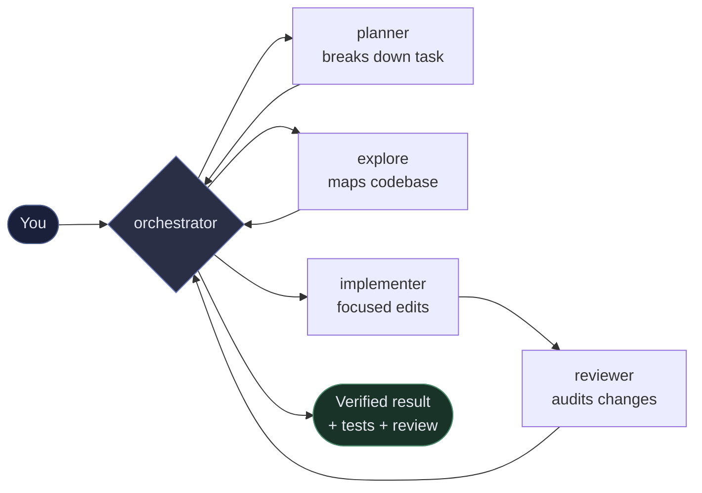

# OpenCode Orchestrator

**Turn one prompt into a coordinated team inside OpenCode.**

Give the orchestrator a task in plain English — it breaks the work down, delegates to specialists, runs work in parallel where safe, and brings back tested, reviewed code. You stay in control while the plugin handles the choreography.

> **Conductor, not worker:** the orchestrator plans and coordinates — specialist subagents do the focused edits.

---

## What it does for you

- **Describe what you want, not how to do it.** `“Add validation to the checkout form and cover it with tests”` Just ask — the orchestrator creates a plan, assigns work, and verifies the result.
- **Parallel where safe, serialized where it matters.** Read-only research runs in parallel. Non-overlapping file scopes coordinate edits so agents avoid working on the same files.
- **Built-in review.** Every implementation is audited by a dedicated reviewer before you see the final result.
- **Asks before it guesses.** When a request is ambiguous, the orchestrator asks you a few targeted questions — with answer options — before breaking the work down. Disable with `"clarify": { "mode": "off" }`.
- **Goals that survive idle.** Start a long-running objective and let it continue during idle periods in the same OpenCode session.
- **Optional power features** when you need them: GitHub and git worktree integration, plus budgets and review gates.

### The team

| Agent | What it does |
|-------|--------------|
| **orchestrator** | Your main partner. Understands your request, plans the work, delegates, and verifies everything. |
| **planner** | Breaks down complex tasks without editing code. |
| **explore** | Maps your codebase, tests, and docs — fast, read-only research. |
| **implementer** | Makes focused code changes within an assigned file scope. |
| **reviewer** | Audits the combined changes before they’re presented to you. |

You only talk to the orchestrator. It handles the rest.

---

## When should I use it?

| You want to… | Use this | Example |
|--------------|----------|---------|
| Build a feature or fix a bug in one go | `/orchestrate` | *“Fix the race in session locking and add a regression test”* |
| Keep a long objective running through idle periods | `/goal` | *“Ship the checkout refactor without regressing payments”* |
| Refactor safely | `/restructure` | `src/core/config.ts --scope=file` |
| Run a written plan | `/run-plan` | `.orchestrator/plans/my-feature.md` |
| Clean up code you just touched | `/polish` | `src/core/policy.ts` |
| Critique a plan before coding | `/stress-plan` | *“Add rate limiting with Redis fallback”* |
| Pause automation | `/halt` | — |
| Hand context to the next session | `/handover` | *“Focus on payments regression”* |

For a single-file typo or one-line edit, just prompt the model directly — you don’t need orchestration.

---

## Installation

**Prerequisites:** [Bun](https://bun.sh), [npm](https://docs.npmjs.com/downloading-and-installing-node-js-and-npm), [OpenCode V2](https://opencode.ai), `git` (and `gh` CLI if you want GitHub features).

Install the [published release from npm](https://www.npmjs.com/package/opencode-v2-agent-orchestrator) in your project:

```sh
cd your-project
npm install --save-dev opencode-v2-agent-orchestrator

# Add the plugin + agents to your opencode.jsonc
./node_modules/.bin/opencode-v2-agent-orchestrator install \
  --model orchestrator=openai/gpt-5#high \
  --model explore=opencode-go/mimo-v2.5

# Verify
./node_modules/.bin/opencode-v2-agent-orchestrator doctor
```

What the installer does:
- Adds the plugin to `opencode.jsonc` (as a local file reference like `./node_modules/.../dist/index.js`)
- Adds the five agents (`orchestrator`, `planner`, `explore`, `implementer`, `reviewer`) if they’re missing
- Leaves your existing config and commands untouched — re-running it is safe

> Working from a source checkout? Configure OpenCode to load `./src/index.ts` and see [Development](#development). This repository's live setup uses global config; the checkout has no repo-level `opencode.jsonc`.

Check that it worked:

```sh
./node_modules/.bin/opencode-v2-agent-orchestrator doctor --json
# plus, once OpenCode is running:
opencode2 api get /api/plugin | jq -r '.data // . | .[].id' | grep opencode-orchestrator
```

---

## Quick start

```sh
cd your-project
opencode2
```

Then in the TUI:

```
/orchestrate add input validation to the user form and cover it with tests
```

The orchestrator will research the codebase, plan the changes, delegate non-overlapping file scopes to `implementer` agents, run a `reviewer`, and report back with verification.

---

## See it in action


| What you'd see | You type |
|----------------|----------|
| Research → plan → parallel edits → review, all summarized in one reply | `/orchestrate add pagination to /api/items with tests` |
| Goal keeps running while you step away | `/goal implement the plan at .orchestrator/plans/checkout.md` |

> **Make it yours:** record a 20–40s GIF with [VHS](https://github.com/charmbracelet/vhs), Screen Studio, or Peek, save it as `docs/assets/orchestrate-demo.gif` (and `goal-demo.gif`), then swap the image above. See `docs/assets/README.md` for a ready-to-use VHS tape.



*You talk only to the orchestrator — it coordinates the specialists and brings back a verified result.*

---

## How to use — commands & examples

All commands are available after installation. They appear inside OpenCode — no files to create manually.

### `/orchestrate <task>` — your main command

One prompt that fans out, integrates, and verifies.

```
/orchestrate fix the race in session locking and add a regression test
/orchestrate implement the new webhook endpoint with tests and docs
/orchestrate add cursor-based pagination to /api/items with tests and update the docs
```

**Tip:** Be specific about the outcome you want and any constraints (“without changing the API”, “cover with tests”).

### `/goal` — for work that outlives one turn

Set an objective keyed to the current OpenCode session. The orchestrator can keep working toward it when that same session emits idle events.

```
/goal ship the checkout refactor without regressing payments
/goal            # show current goal
/goal pause      # pause without deleting
/goal resume     # continue
/goal clear      # remove it
```

Goals auto-continue when that session goes idle (up to 50 continuations by default, with a cooldown). The orchestrator checks before each continuation that the goal is still active and unchanged. Deleting the session removes its goal state.

### `/restructure` — safe refactoring

Behavior must not change. The plugin maps references and tests first.

```
/restructure src/core/config.ts --scope=file
/restructure src/opencode-v2 --scope=module --risk=broad
```

Valid scopes are `--scope=file|module|project`; with project scope, target `.` or `project`.

### `/run-plan` — execute a written plan

Put plans in `.orchestrator/plans/*.md`.

```
/run-plan                    # picks the only incomplete plan, or resumes
/run-plan my-feature         # .orchestrator/plans/my-feature.md
```

Mark a plan done with `status: complete` in frontmatter or a `## Status / complete` heading.

### Other commands

```
/halt              # pause goal + plan runs
/halt goal
/handover          # get a summary brief for the next person/session
/handover focus on payments regression
/polish            # clean up only files changed in this branch
/polish src/core/policy.ts src/core/prompts.ts
/stress-plan add rate limiting to the API with redis fallback
```

`/stress-plan` drafts a plan, then critiques it from four angles (correctness, simplicity, security, feasibility) before finalizing.

---

## Configuration

You mostly configure **models**, not plugin options. Use OpenCode’s native `agents.<id>.model`:

```jsonc
// opencode.jsonc
{
  "plugins": [{
    "package": "./node_modules/opencode-v2-agent-orchestrator/dist/index.js",
    "options": {
      "orchestrator": "orchestrator",
      "roles": {
        "planning": "planner",
        "research": "explore",
        "implementation": "implementer",
        "review": "reviewer"
      },
      "max_parallel": 4,        // how many subagents at once (1..8)
      "require_review": true,   // always run reviewer before finishing
      "strict_agents": true,    // fail if a required agent is missing
      "commands": {},           // disable a command, e.g. { "polish": false }
      "goal": { "auto_continue": true, "max_continuations": 50, "cooldown_ms": 1000 },
      "github": { "enabled": false, "allow_mutations": false },
      "worktree": { "enabled": false, "allow_mutations": false, "root": null },
      "trace": { "mode": "off" },                  // off | memory | snapshot
      "budget": { "mode": "advisory" },            // advisory | stop-between-steps
      "review": { "mode": "prompt", "max_rounds": 2 }, // prompt | bounded
      "clarify": { "mode": "auto" }                // auto | off — ask targeted clarifying questions when a task is ambiguous
    }
  }],
  // If worktree.root lives outside your project, allow it:
  // "permissions": [{ "action": "external_directory", "resource": "/srv/worktrees/*", "effect": "allow" }],

  "agents": {
    "orchestrator": { "mode": "primary",  "model": "openai/gpt-5#high" },
    "planner":      { "mode": "subagent", "model": "openai/gpt-5-mini" },
    "explore":      { "mode": "subagent", "model": "opencode-go/mimo-v2.5" },
    "implementer":  { "mode": "subagent", "model": "opencode-go/deepseek-v4-flash#high" },
    "reviewer":     { "mode": "subagent", "model": "opencode-go/grok-4.6#high" }
  }
}
```

### Choosing models

| Agent | Recommended tier | Why |
|-------|----------------|-----|
| `orchestrator` | 5 (frontier) | Never downgrade this one first — it does all coordination |
| `reviewer` | 4–5 | Needs strong judgment |
| `implementer` / `planner` | 4 | Capable but cheaper than frontier |
| `explore` | 2 (cheap/fast) | Runs in parallel — cheap wins |

Model IDs shown here are illustrative; availability varies by provider and account.

Change a model later by editing `agents.<id>.model` directly — no reinstall needed.

---

## Real-world examples

**Add a feature with tests**

```
/orchestrate add cursor-based pagination to GET /api/items,
  keep the existing offset param working, and update the API docs
```

→ The orchestrator will explore existing pagination, plan the API change, delegate implementation with tests, run a reviewer, and summarize.

**Fix a bug with a regression test**

```
/orchestrate fix the checkout race when two tabs submit at once,
  add a regression test that reproduces it first
```

**Long-running objective**

```
/goal implement the plan at .orchestrator/plans/checkout.md
# leave this OpenCode session idle, then come back
/goal   # check progress
```

**Safe restructure**

```
/restructure src/services/payments --scope=module --risk=conservative
```

---

## Optional power features

All disabled by default. Enable only what you need.

### GitHub integration

Let the orchestrator create and list issues/PRs via your local `gh` CLI.

```jsonc
"github": { "enabled": true, "allow_mutations": false }
```

- Read-only (list/view) needs only `enabled: true`
- Creating issues/PRs needs `allow_mutations: true` **and** `confirm: true` on each call
- Auth stays with `gh` — run `gh auth login` with least privilege. The plugin never reads tokens.
- Verify: `orchestrator_github_capabilities` (inside OpenCode) or `gh auth status` locally

### Git worktrees (separate checkouts)

Give the current session a separate checkout and branch without changing your main checkout.

```jsonc
"worktree": { "enabled": true, "allow_mutations": true, "root": "/srv/worktrees" }
```

- One managed worktree per current session, under the `root` you choose
- The orchestrator creates → enters → then delegates. Entering moves only the current session; delegated children inherit and share that context, not an atomic sandbox.
- Create, push, and cleanup require `worktree.allow_mutations: true` and a literal `confirm: true` on each call. Enter requires neither beyond `worktree.enabled: true`.
- Verify: `./node_modules/.bin/opencode-v2-agent-orchestrator doctor` checks `git worktree list`

### Budgets, tracing & review gates (observability)

For teams that want cost/usage limits or a stricter review gate:

```jsonc
"trace": { "mode": "snapshot" },
"budget": {
  "mode": "stop-between-steps",
  "max_steps": 1000,
  "max_tokens": null,
  "max_cost_usd": 10,
  "max_wall_clock_ms": null,
  "max_retries": 5
},
"review": { "mode": "bounded", "max_rounds": 2 } // requires explicit approve before finishing
```

- **Trace** `memory` keeps bounded metadata in memory and never persists it; `snapshot` additionally stores one bounded current metadata record per session. Neither stores prompts, transcripts, tool input/output, arbitrary payloads, or file contents.
- **Budget** supports the five optional limits shown above; omitting a limit or setting it to `null` means no limit.
- **Budget** `advisory` only reports; `stop-between-steps` pauses *between* steps, never mid-tool
- **Bounded review** needs an explicit `approve` with three checks (`diff`, `scope`, `verification`)

> These are opt-in. The defaults (`off` / `advisory` / `prompt`) change nothing until you enable them. Curious about the details? See the collapsed **Advanced** sections below.

---

## Troubleshooting

**Is the plugin loaded?**

```sh
./node_modules/.bin/opencode-v2-agent-orchestrator doctor
./node_modules/.bin/opencode-v2-agent-orchestrator doctor --json
```

`doctor` checks config, agents, and commands (always) plus advisory checks for `git`/`gh` on *this* machine. Runtime checks never fail the report — they’re informational. Inside OpenCode, the server-side tools (`orchestrator_github_capabilities`, `orchestrator_worktree_status`) are authoritative.

**Plugin not appearing in OpenCode?**
- For an installed project, make sure its `opencode.jsonc` points at `./node_modules/opencode-v2-agent-orchestrator/dist/index.js`; this repository's source checkout is loaded as `./src/index.ts` from global config
- Restart OpenCode: `opencode2 service restart` then reopen from your project dir
- Check logs: `~/.local/share/opencode/log/opencode.log` should show `loading plugin .../dist/index.js` and `agent.updated` / `command.updated`

**GitHub or worktree not working?**
- Ensure `gh` is installed and authenticated (`gh auth status` exit code 0)
- Ensure `git worktree list --porcelain` works and your `worktree.root` is an absolute path
- For worktree create/push/cleanup, enable the feature and mutations, then pass literal `confirm: true`; enter needs only `worktree.enabled: true`

---

<details>
<summary>How the orchestration works (for the curious)</summary>

- **Roles are prompt policy, not hard sandboxing.** `explore` is told not to use shell, `planner`/`reviewer` not to edit, workers not to spawn subagents — but V2’s plugin API doesn’t enforce this at the filesystem level. Treat it as strong instructions.
- **File ownership coordinates agents.** The orchestrator assigns non-overlapping file scopes to each `implementer`, but those prompt-level scopes are not filesystem isolation. `max_parallel` (default 4) caps concurrency.
- **Handoffs are structured.** Workers return a five-field summary (`Outcome / Files / Verification / Risks / Follow-up`) plus a version-1 JSON envelope. The orchestrator can run `orchestrator_handoff_validate` for deterministic checks before using a handoff.
- **Review is prompt-based by default.** `require_review: true` means the orchestrator *asks* a reviewer. There’s no hard runtime gate — `bounded` review adds an explicit `review_get` / `review_transition` flow with a circuit breaker if you need it.
- **State lives in OpenCode storage.** Goals and plan runs are keyed to the current session and persist through its idle periods via `ctx.storage` with per-session locks; session deletion removes that state. Conversations remain the source of truth.

Want the formal contracts? `docs/phase-1/` has them (D2 handoff, D4 gate, etc.) — you don’t need them to get started.

</details>

<details>
<summary>Limitations & V2 boundaries</summary>

- No atomic isolation for subagents — worktrees are plain `git worktree` dirs, not containers.
- `doctor` probes *this* machine’s `PATH`; the live server’s capabilities are checked via server-side tools.
- Validation tools (`orchestrator_handoff_validate`, etc.) are callable helpers — they don’t run automatically on every worker output.
- No persistence of evidence receipts beyond the tool response.
- Token/cost tracking uses `session.usage.updated` snapshots; if the host doesn’t emit them, budgets report `unknown`.
- S3/V1 controls are opt-in and bounded: budgets pause only *between* steps, review gates only after an explicit transition. No in-flight cancellation.

</details>

---

## Development

```sh
bun install
bun run dev:setup        # writes gitignored dev/project/opencode.jsonc from template
bun run dev:v2           # standalone opencode2 with XDG dirs under dev/state
bun run dev:v2:dist      # loads ../../dist/index.js (run bun run build first)
bun run typecheck
bun test
bun run build            # emits dist/index.js, dist/tui.js, dist/commands.js, dist/installer.js, dist/cli/index.js
```

`dev/project/opencode.jsonc` and `dev/state/*` are gitignored — they never touch global `~/.config/opencode`.

## Compatibility

Tested against:

- `@opencode-ai/plugin` `0.0.0-beta-19086`
- `@opencode-ai/sdk` `0.0.0-dev-19087` (integration tests)

Main plugin sets `tui: true` and publishes `./tui`. CLI-only config belongs in `cli.json`.

Inspired by multi-agent orchestration in `oh-my-openagent` at `64d89819ef1fde81712630f8e5d798be9e4e8867` — independent implementation, no affiliation.
